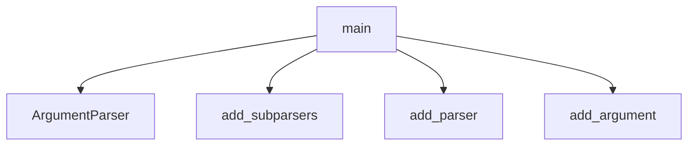

# System Architecture Analysis
<!-- generated in 0.00s -->

## Overview

- **Project**: /home/tom/github/if-uri/urirun-connector-http-check
- **Primary Language**: python
- **Languages**: python: 3, shell: 2, json: 2, toml: 1
- **Analysis Mode**: static
- **Total Functions**: 6
- **Total Classes**: 0
- **Modules**: 9
- **Entry Points**: 1

## Architecture by Module

### urirun_connector_http_check.core
- **Functions**: 4
- **File**: `core.py`

### urirun_connector_http_check.cli
- **Functions**: 2
- **File**: `cli.py`

## Key Entry Points

Main execution flows into the system:

### urirun_connector_http_check.cli.main
- **Calls**: argparse.ArgumentParser, parser.add_subparsers, sub.add_parser, status.add_argument, status.add_argument, status.add_argument, sub.add_parser, sub.add_parser

## Process Flows

Key execution flows identified:

### Flow 1: main
```
main [urirun_connector_http_check.cli]
```

## Data Transformation Functions

Key functions that process and transform data:

## Public API Surface

Functions exposed as public API (no underscore prefix):

- `urirun_connector_http_check.core.check_url` - 19 calls
- `urirun_connector_http_check.cli.main` - 15 calls
- `urirun_connector_http_check.cli.emit` - 2 calls
- `urirun_connector_http_check.core.connector_manifest` - 1 calls
- `urirun_connector_http_check.core.urirun_bindings` - 1 calls

## System Interactions

How components interact:



## Reverse Engineering Guidelines

1. **Entry Points**: Start analysis from the entry points listed above
2. **Core Logic**: Focus on classes with many methods
3. **Data Flow**: Follow data transformation functions
4. **Process Flows**: Use the flow diagrams for execution paths
5. **API Surface**: Public API functions reveal the interface

## Context for LLM

Maintain the identified architectural patterns and public API surface when suggesting changes.